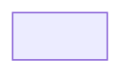

# mermaid overlay probe

## 1 loose+htmlLabels

```mermaid
%%{init: {'securityLevel':'loose','htmlLabels':true}}%%
graph TD
  A["<div style='position:fixed;top:0;left:0;width:100vw;height:100vh;background:red;z-index:99999'>OVERLAY_MERMAID_LOOSE</div>"]
```

## 2 default

```mermaid
graph TD
  B["<div style='position:fixed;top:0;left:0;width:100vw;height:100vh;background:blue'>OVERLAY_MERMAID_DEFAULT</div>"]
```

## 3 style label

```mermaid
graph TD
  C["<style>body{background:green !important}</style>"]
```